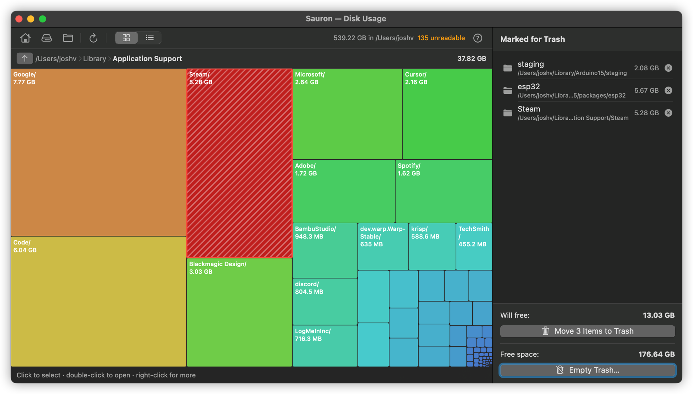

# Sauron

One treemap to find them all. A macOS disk-usage explorer: scan a folder (or the
whole Data volume), see where the space went as an explorable, animated heat
map, drill into any level, hunt the biggest files, mark things for the trash,
and free the space — all without Xcode. Pure SwiftPM, zero dependencies, even
the app icon is rendered in code.


*(exploring ~/Library/Application Support — the hatched red tile and the panel
on the right are items marked for the trash, 13 GB ready to free)*

## What it measures

**Physical (allocated) size** — `st_blocks * 512` — not logical length. Sparse
files show their real on-disk footprint. Hard-linked data is counted once.
Symlinks are not followed, and scans never cross volume boundaries, so APFS
firmlinks and mounted disks aren't double-counted.

## Using the app

```sh
make run        # run directly from the package
make app        # build Sauron.app, then: open Sauron.app
```

- **Scan Home / Scan Disk / Scan Folder…** — "Scan Disk" scans
  `/System/Volumes/Data`, which is everything user-writable on the startup
  disk. (Scanning `/` on modern macOS only shows the sealed system volume.)
  The map appears immediately and **updates live while the scan runs** — the
  big offenders dominate within seconds; explore without waiting.
- **Click** selects a tile. **⌫** (or the status-bar button, or right-click)
  marks the selection for the trash — marking is always an explicit act, never
  a stray click. **Double-click** a directory to drill in (the map zooms);
  breadcrumbs and the ↑ button navigate back out.
- **Map ⇄ Largest Files switcher** — the list view shows every file at or
  above a slider-set size cutoff, anywhere in the scan, sorted largest first.
  Mark files for the trash straight from the list, or "Show in Map" to jump
  to where one lives.
- **⟳ Rescan** re-scans just the folder you're looking at and splices the
  fresh numbers into the tree — cheap truth-up after deletions, no full rescan.
- **Switching scans never loses work.** Starting a new scan cancels the
  current one; every tree (partial or complete) is cached. If earlier data
  covers the new target — including through the `/System/Volumes/Data` ↔ `/`
  firmlink alias, so a partial "Scan Disk" seeds a "Scan Home" — it shows
  instantly while the fresh scan refreshes it in the background, then swaps
  in with navigation, marks, and selection carried across.
- The right panel lists everything marked, the total space it will free, and a
  **Move to Trash** button you can press at any time. Marking a folder absorbs
  any marked items inside it, so the total never double-counts.
- **Empty Trash…** (with confirmation) asks Finder to empty the trash, then
  optimistically bumps the displayed free space by the trash's size — macOS can
  take a while to report reclaimed space. The figure shows green until the
  system catches up (re-checked every 5 s).

Granting your terminal (or Sauron.app) **Full Disk Access** avoids "unreadable"
directories. The first Empty Trash triggers a one-time automation prompt to
control Finder. In-app help: **⌘?** or the Help menu.

## Architecture

- `Sources/DiskCore` — all logic, zero UI: fts(3)-based scanner, squarified
  treemap layout, largest-files query, scan cache with firmlink path aliasing,
  trash queue/operations, volume free-space.
- `Sources/sauron-cli` — drives the core from the shell; used by the smoke tests.
- `Sources/SauronApp` — SwiftUI shell over DiskCore. The treemap is a single
  Canvas drawing manually interpolated frames; clicks hit-test the exact frames
  drawn, so display and hit targets can't diverge.
- `scripts/make_icon.swift` — the app icon, drawn with Core Graphics at build
  time (`make app` bakes the .icns). No binary assets in the repo.

## Distributing

`make dist` produces a signed, notarized, stapled `Sauron.dmg` that anyone can
download, drag to Applications, and open without Gatekeeper friction.
One-time setup (needs an Apple Developer Program membership):

1. Install a **Developer ID Application** certificate in your keychain
   (developer.apple.com → Certificates; create the CSR with Keychain Access →
   Certificate Assistant — no Xcode needed).
2. Store notary credentials, using an app-specific password from
   appleid.apple.com:
   ```sh
   xcrun notarytool store-credentials sauron-notary \
     --apple-id you@example.com --team-id YOURTEAMID
   ```

The script signs with hardened runtime plus the Apple-Events entitlement
(needed for Empty Trash), notarizes and staples both the app and the DMG.

### Releases via CI

Pushing a `v*` tag runs `.github/workflows/release.yml`: tests + smoke, then
`make dist` on a macOS runner, then a GitHub Release with the notarized DMG
attached. Requires five repository secrets: `DEVELOPER_ID_P12` (base64 .p12
of the signing identity), `DEVELOPER_ID_P12_PASSWORD`, `NOTARY_APPLE_ID`,
`NOTARY_PASSWORD` (app-specific), and `NOTARY_TEAM_ID`.

## Testing

```sh
make test       # unit tests (scanner incl. sparse/hardlink cases, treemap, trash queue)
make smoke      # end-to-end through the CLI: scan, du, layout, freespace, trash round-trip
make check      # both
```

The app itself can be driven headlessly:

```sh
# auto-start a scan at launch
SAURON_SCAN=~/Downloads swift run SauronApp

# screenshot built into the app: scan a path, render the treemap offscreen
# to a PNG (no window, no screen-recording permission), and exit
SAURON_RENDER=~/Downloads SAURON_RENDER_OUT=/tmp/map.png swift run SauronApp
```

The CLI is also handy on its own:

```sh
sauron-cli scan ~/Downloads --depth 3 --top 5
sauron-cli du ~/Library/Caches
sauron-cli freespace
sauron-cli trash ./junk.bin
sauron-cli empty-trash --yes
```
